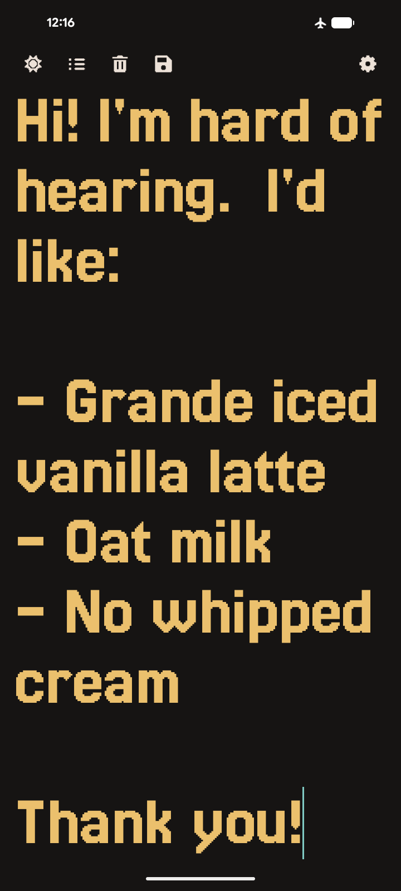
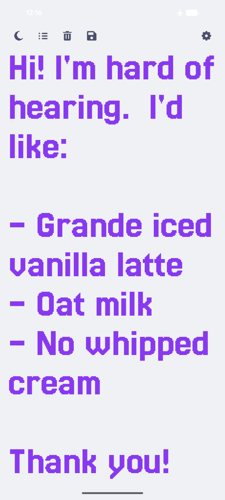
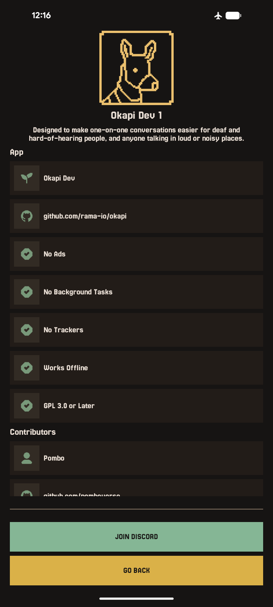

# Okapi

**Okapi** is a **minimal, privacy-first Android communication aid** designed to make one-on-one
conversations easier for deaf and hard-of-hearing people, and anyone talking in loud or noisy
places.

Built entirely in **native Kotlin**, Okapi runs fully **on-device**, avoids tracking, and keeps the
message on screen as large and legible as possible so it can be read at a glance.

---

## Screenshots

| Home | Text Preview Dark | Text Preview Light | About |
| - | - | - | - |
|  |  |  |  |

---

## Permissions

Okapi requires **no special permissions**:

- No camera, microphone, or contacts access
- No network access is required

Everything you type stays on your device.

---

## Features

- **Large, self-sizing text**: Type your message and it automatically grows to fill the screen,
  wrapping across multiple lines if needed, without ever shrinking below 50sp, so it stays
  readable from across a table.
- **Saved messages**: Reuse phrases you've typed before instead of retyping them. Tap "Add
  Message" to start a new one, or tap any saved message to bring it back up.
- **Manual reordering**: Tap the sort icon on the home screen to reveal up/down arrows next to each saved
  message and arrange them in whatever order makes sense to you.
- **Light/dark accessibility toggle**: Switch instantly between a light and a dark theme. Handy
  for reading outdoors on a sunny day versus in a dim indoor conversation. Both themes can be choose in Settings.
- **Quick clear**: Double-tap the message while editing to instantly clear it and start over
  (can be turned off in Settings).
- **Explicit save**: Nothing is written to your saved messages until you tap Save, so you're
  always in control of what gets kept.

---

## Installation

  
  &nbsp;
  
  &nbsp;
  

---

## License

**Okapi** is Free Software. You are free to use, study, share, and improve it under the terms of
the **GNU General Public License v3** or later.

---

## Tested Devices

| Device | OS | Status |
| - | - | - |
| Pixel 8 Pro | Android 17 | Y |

---

## Documents

- [Branding](./docs/branding.md)
- [Attributions](./docs/attributions.md)